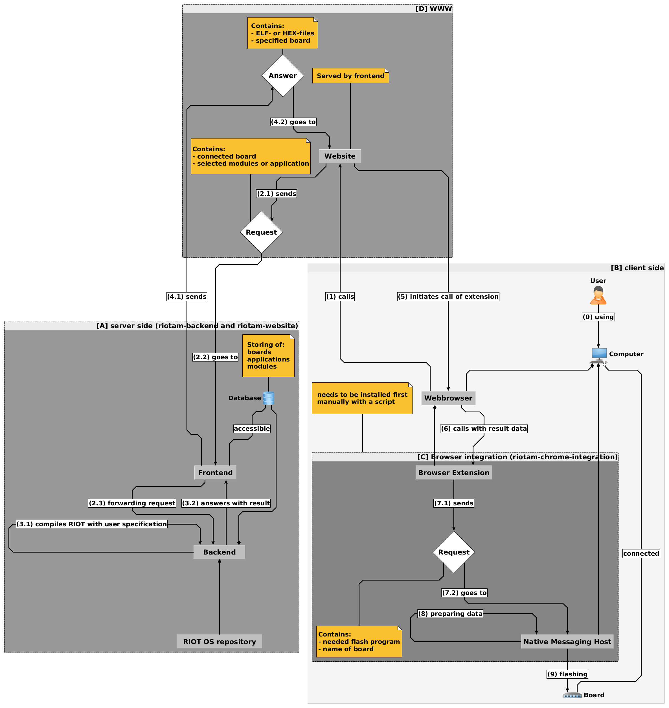

# RIOT-App-Market

## The Project consists of the following 3 modules:
* [Chrome integration](https://github.com/HendrikVE/riotam-chrome-integration "https://github.com/HendrikVE/riotam-chrome-integration")
* [Backend](https://github.com/HendrikVE/riotam-backend "https://github.com/HendrikVE/riotam-backend")
* [RIOT App Market Website](https://github.com/HendrikVE/riotam-website "https://github.com/HendrikVE/riotam-website")

## Below is a flowchart to illustrate the process of using the RIOT App Market website and flash the users connected device:

## To set up the system you need:
* python-mysqldb
* a MySQL database

### More Information
Visit [RIOT OS Website](https://riot-os.org/ "https://riot-os.org/") for details

Graphics are editable with [yEd](http://www.yworks.com/products/yed "http://www.yworks.com/products/yed")

## LICENSE
The project is licensed under the GNU Lesser General Public License
(LGPL) version 2.1 as published by the Free Software Foundation.

All code files contain licensing information.