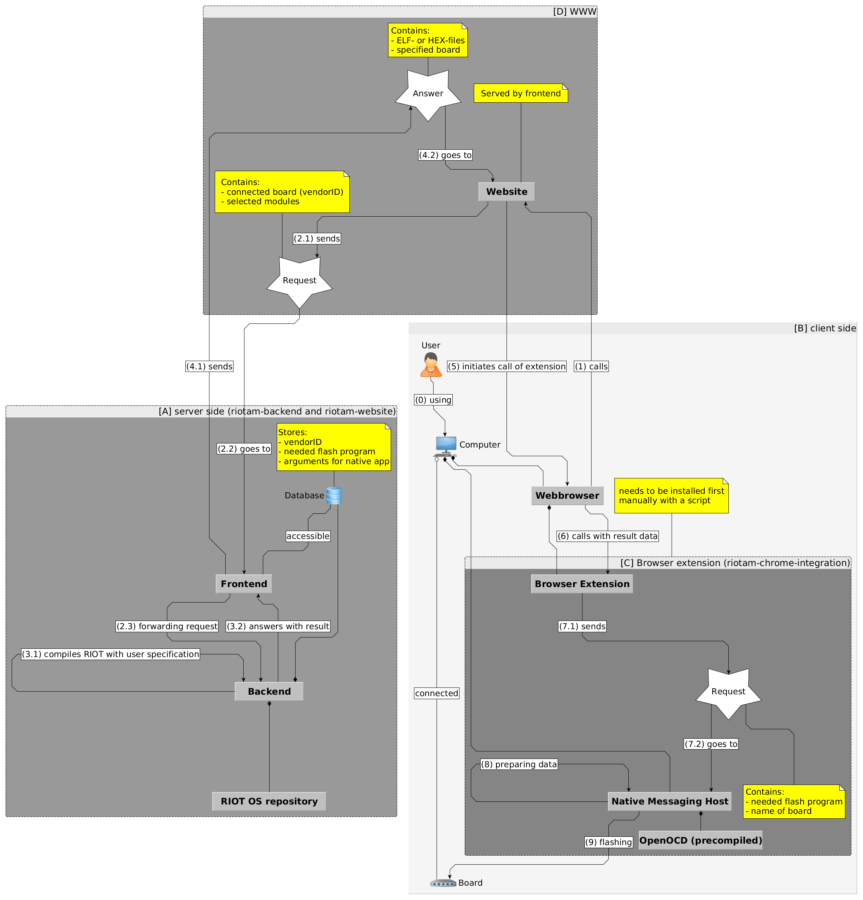

# RIOT-App-Market

## The Project consists of the following 3 modules:
* [Google Chrome extension and native messaging host](https://github.com/HendrikVE/Google-Chrome-Extension-and-Native-Messaging-Host-for-RIOT-App-Market "ttps://github.com/HendrikVE/Google-Chrome-Extension-and-Native-Messaging-Host-for-RIOT-App-Market")
* [Server environment](https://github.com/HendrikVE/Server-Environment-for-RIOT-App-Market "https://github.com/HendrikVE/Server-Environment-for-RIOT-App-Market")
* [RIOT App Market Website](https://github.com/HendrikVE/Website-for-RIOT-App-Market "https://github.com/HendrikVE/Website-for-RIOT-App-Market")

## Below is a flowchart to illustrate the process of using the RIOT App Market website and flash the users connected device:
